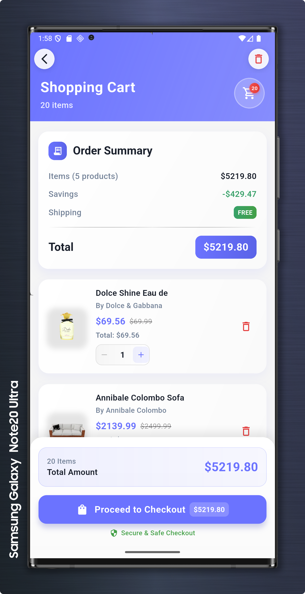

# 🛒 Wasil Tech Task - Flutter E-commerce Application

A modern, feature-rich Flutter e-commerce application showcasing product browsing, filtering, and cart management with clean architecture and stunning animations.

## ✨ Features

### 🎯 Core Functionality
- **Product Browsing**: View products in a beautiful grid layout
- **Smart Search**: Real-time search through product titles, descriptions, and brands
- **Advanced Filtering**: Filter by categories and price range
- **Shopping Cart**: Add/remove items with quantity management
- **Product Details**: Detailed product view with images and specifications

### 🎨 UI/UX Excellence
- **Modern Design**: Clean, Material Design-inspired interface
- **Smooth Animations**: Stunning animations powered by `flutter_animate`
- **Responsive Layout**: Optimized for different screen sizes
- **Interactive Elements**: Haptic feedback and visual feedback
- **Loading States**: Beautiful shimmer effects during data loading

### 🏗️ Technical Highlights
- **Clean Architecture**: Separation of concerns with proper layering
- **BLoC Pattern**: State management using Cubit/BLoC
- **Error Handling**: Comprehensive error handling with user-friendly messages
- **Performance**: Optimized scrolling and memory management
- **Code Quality**: Well-documented and maintainable code

## 📱 Screenshots


| **Home Screen**                         | **Product Details**                         | **Shopping Cart**                                                                 |
|----------------------------------------|---------------------------------------------|-----------------------------------------------------------------------------------|
|  | <br><br>  |   |

---


| **LogIn Screen**                         | **Register Screen**                          | **Loading States**                         | **Error Handling**                        |
|-------------------------------------------|------------------------------------------|--------------------------------------------|-------------------------------------------|
|   |  |  |   |

## 🏛️ Architecture

The app follows **Clean Architecture** principles with clear separation of concerns:

```
lib/
├── core/
│   ├── constants/          # App constants (colors, strings, etc.)
│   ├── errors/            # Error handling
│   ├── network/           # Network configuration
│   └── utils/             # Utility functions
├── features/
│   ├── products/
│   │   ├── data/          # Data layer (repositories, models, data sources)
│   │   ├── domain/        # Domain layer (entities, use cases)
│   │   └── presentation/  # UI layer (pages, widgets, BLoC)
│   └── cart/
│       ├── data/
│       ├── domain/
│       └── presentation/
└── main.dart
```

### 🧩 Design Patterns Used
- **Repository Pattern**: Abstract data access
- **BLoC Pattern**: Reactive state management
- **Dependency Injection**: Using get_it for IoC
- **Factory Pattern**: For creating instances
- **Observer Pattern**: For state changes

## 🚀 Getting Started

### Prerequisites
- Flutter SDK (>=3.0.0)
- Dart SDK (>=3.0.0)
- Android Studio / VS Code
- Git

### Installation

1. **Clone the repository**
```bash
git clone https://github.com/shahbbo/wasil-tech-task.git
cd wasil-tech-task
```

2. **Install dependencies**
```bash
flutter pub get
```

3. **Run the app**
```bash
flutter run
```

### Configuration

The app uses the [DummyJSON API](https://dummyjson.com/products) for product data. No additional configuration is required.

## 📦 Dependencies

### Core Dependencies
```yaml
dependencies:
  flutter: ^3.19.0
  flutter_bloc: ^9.1.1
  equatable: ^2.0.7
  dartz: ^0.10.1
  get_it: ^8.0.3
```

### UI & Animations
```yaml
  flutter_animate: ^4.5.2
  cached_network_image: ^3.4.1
  cherry_toast: ^1.13.0
  skeletonizer: ^2.1.0+1
```

### Network & Data
```yaml
  dio: ^5.8.0+1
  firebase_auth: ^5.6.2
  firebase_core: ^3.15.1
  shared_preferences: ^2.5.3
  internet_connection_checker_plus: ^2.7.2
```

### Development
```yaml
dev_dependencies:
  flutter_test: ^3.19.0
  flutter_lints: ^3.0.0
```

## 🎯 Key Features Implementation

### 🔍 Smart Filtering System
- **Category Filters**: Dynamic category chips with smooth animations
- **Price Range**: Interactive slider with real-time updates
- **Search Integration**: Filters work seamlessly with search
- **State Persistence**: Maintains filter state across navigation

### 🛒 Shopping Cart Management
- **Add to Cart**: One-tap adding with visual feedback
- **Quantity Control**: Increase/decrease item quantities
- **Cart Persistence**: Uses local storage for cart data
- **Real-time Updates**: Instant cart count updates

### ⚡ Performance Optimizations
- **Lazy Loading**: Efficient memory usage with ListView.builder
- **Image Caching**: Cached network images for better performance
- **State Management**: Optimized BLoC usage to prevent unnecessary rebuilds
- **Smooth Scrolling**: CustomScrollView with slivers for better performance

## 🎨 UI Components

### Custom Widgets
- **ProductCard**: Animated product display with price and rating
- **CategoryChips**: Horizontal scrollable category selector
- **CustomSearchBar**: Animated search input with clear functionality
- **FilterBottomSheet**: Modern bottom sheet with price range slider
- **CustomAppBar**: Branded app bar with cart badge

### Animations
- **Staggered Animations**: Sequential element appearances
- **Page Transitions**: Custom route transitions
- **Loading States**: Shimmer effects and skeleton screens
- **Interactive Feedback**: Button press animations and haptics

## 📊 State Management

### BLoC Architecture
```dart
// Product Cubit manages all product-related state
class ProductCubit extends Cubit<ProductState> {
  // Load products from API
  Future<void> loadProducts()
  
  // Filter by category
  Future<void> filterByCategory(String category)
  
  // Search products
  void searchProducts(String query)
  
  // Filter by price range
  void filterByPriceRange(double minPrice, double maxPrice)
}
```

### State Classes
- **ProductInitial**: Initial loading state
- **ProductLoading**: Data fetching state
- **ProductLoaded**: Success state with data
- **ProductError**: Error state with message

## 🤝 Contributing

We welcome contributions! Please follow these steps:

1. **Fork the repository**
2. **Create a feature branch** (`git checkout -b feature/amazing-feature`)
3. **Commit your changes** (`git commit -m 'Add amazing feature'`)
4. **Push to the branch** (`git push origin feature/amazing-feature`)
5. **Open a Pull Request**

### Code Style Guidelines
- Use meaningful variable and function names
- Add comments for complex logic
- Write tests for new features

## 👨‍💻 Author

**Shahbbo** - *Flutter Developer*
- GitHub: [@shahbbo](https://github.com/shahbbo)
- LinkedIn: [shahbbo](https://linkedin.com/in/mahmoud-shahbo)
- Email: shahbo.dev@gmail.com

## 🙏 Acknowledgments

- **Flutter Team** for the amazing framework
- **DummyJSON** for providing the API
- **Material Design** for design inspiration
- **Open Source Community** for the excellent packages used

## 📞 Support

If you like this project, please give it a ⭐ on GitHub!

For support, email shahbo.dev@gmail.com or create an issue on GitHub.

---

<div align="center">
  <p>Made with ❤️ by <a href="https://github.com/shahbbo">shahbbo</a></p>
  <p>🚀 Happy Coding!</p>
</div>
